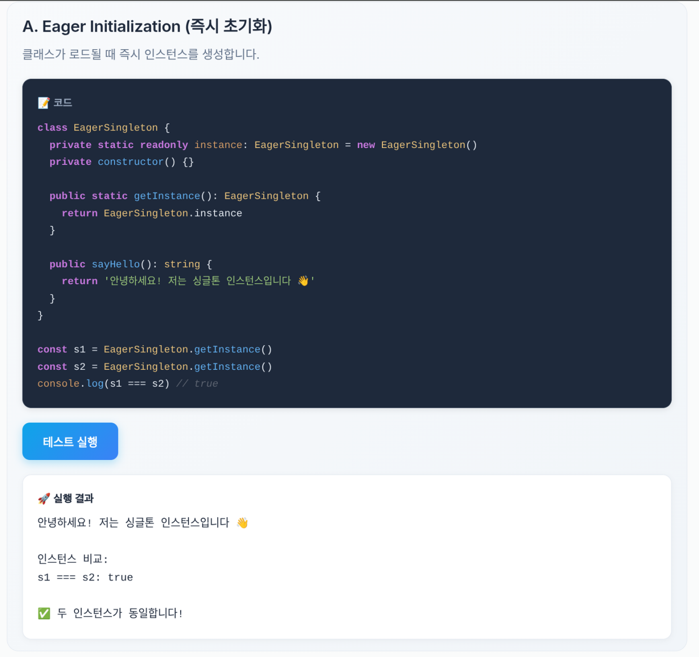

# design-pattern

**[웹사이트 바로가기](https://lxxzdrgnl.github.io/PB_assignment_3/)**

각 디자인 패턴 예제를 웹사이트에서 직접 실행하고 상호작용할 수 있도록 구현했습니다. 코드 스크린샷 대신, 방문자가 실시간으로 값을 바꾸고 결과를 확인할 수 있는 동적인 데모를 제공합니다.



## Project Setup

```sh
npm install
```

### Compile and Hot-Reload for Development

```sh
npm run dev
```

### Type-Check, Compile and Minify for Production

```sh
npm run build
```